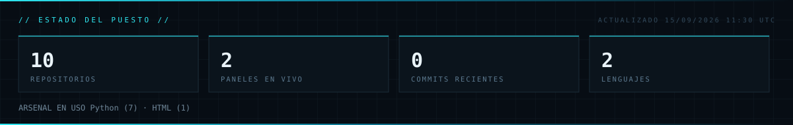

<p align="center">
  
</p>

<p align="center">
  
</p>

<p align="center">
  <a href="https://carlosvillalbalagos.com"></a>
  <a href="https://cti.carlosvillalbalagos.com"></a>
  <a href="https://dfir.carlosvillalbalagos.com"></a>
  <a href="https://linkedin.com/in/carlos-villalba-lagos"></a>
  <a href="mailto:contact@carlosvillalbalagos.com"></a>
</p>

<p align="center">
  
  
</p>

## `00 // FICHA DE IDENTIFICACIÓN`

```yaml
title: Analista SOC con perfil DFIR e incident response
id: ch4rl13-2026
status: operativo
description: |
    Detecta a un analista de SOC 24x7 que, fuera de turno,
    construye lo mismo que hace dentro: triage forense con cadena de custodia,
    detecciones validadas contra ataques reales e infraestructura donde probarlo
    todo antes de que llegue a produccion.
references:
    - https://carlosvillalbalagos.com
    - https://cti.carlosvillalbalagos.com
    - https://dfir.carlosvillalbalagos.com
logsource:
    product: soc
    service: turno_24x7
    category: respuesta_a_incidentes
detection:
    selection_rol:
        funcion:
            - triaje y escalado de alertas
            - investigacion y analisis de causa raiz
            - ingenieria de deteccion
            - triage forense y cadena de custodia
    selection_prueba:
        operaciones_en_produccion: 2
        repositorios_publicos: 5
    filter_ruido:
        proyecto: solo_teoria
    condition: selection_rol and selection_prueba and not filter_ruido
falsepositives:
    - Perfiles que enumeran herramientas sin nada desplegado detras
level: high
```

## `01 // LO QUE CONSTRUYO Y DÓNDE ESTÁ LA PRUEBA`

Cada afirmación tiene un repositorio detrás. Si algo de aquí no se sostiene al abrirlo, abre un issue.

| Capacidad | Dónde está la prueba |
|---|---|
| **Detection as code** — Sigma validado con Atomic Red Team y medido contra ATT&CK | [Detection-lab](https://github.com/BlueShield-Ch4rl13/Detection-lab) |
| **Triage forense multiplataforma** con cadena de custodia y veredicto razonado | [FtriageDFIR](https://github.com/BlueShield-Ch4rl13/FtriageDFIR) · [panel en vivo](https://dfir.carlosvillalbalagos.com) |
| **Despliegue y ajuste de SIEM** — Wazuh, Suricata y detección en kernel | [Infra-SocAnalyst](https://github.com/BlueShield-Ch4rl13/Infra-SocAnalyst) |
| **Inteligencia de amenazas automatizada** priorizada por explotación activa | [ScriptNewsCTI](https://github.com/BlueShield-Ch4rl13/ScriptNewsCTI) · [panel en vivo](https://cti.carlosvillalbalagos.com) |
| **Análisis de malware** estático y dinámico con extracción de indicadores | [Malpipe](https://github.com/BlueShield-Ch4rl13/Malpipe) |
| **Automatización de respuesta** — SOAR con TheHive, MISP y Shuffle | [Infra-SocAnalyst](https://github.com/BlueShield-Ch4rl13/Infra-SocAnalyst) |

## `02 // OPERACIONES`

 **NEWS CTI** &nbsp; <br>
Panel de ciberamenazas que se responde solo. Prioriza **por explotación activa, no por CVSS teórico**: un 7.5 que ya está en el catálogo KEV pesa más que un 9.8 sin exploit conocido.<br>
   &nbsp; `+48.000 IoCs` `4 fuentes` `refresco 6 h`<br>
▸ [**abrir panel**](https://cti.carlosvillalbalagos.com) &nbsp; ▸ [código](https://github.com/BlueShield-Ch4rl13/ScriptNewsCTI)

 **FTRIAGE DFIR** &nbsp; <br>
Triage forense sobre tres sistemas. Recolecta en el **orden de volatilidad de la RFC 3227**, hashea cada artefacto en la adquisición y cierra con un veredicto razonado: comprometido, sospechoso o sin indicadores.<br>
    &nbsp; `cadena de custodia` `ATT&CK`<br>
▸ [**abrir panel**](https://dfir.carlosvillalbalagos.com) &nbsp; ▸ [código](https://github.com/BlueShield-Ch4rl13/FtriageDFIR)

 **MALPIPE** &nbsp; <br>
Análisis de malware estático y dinámico. Detona la muestra en aislado, extrae indicadores y produce un informe listo para alimentar la inteligencia. Cierra el hueco entre «tengo un fichero raro» y «sé qué buscar en el resto del parque».<br>
   &nbsp; `detonación aislada` `extracción de IoCs`<br>
▸ [código](https://github.com/BlueShield-Ch4rl13/Malpipe)

 **INFRA-SOCANALYST** &nbsp; <br>
SOC completo en contenedores con detección en **tres capas**: Suricata ve el C2 aunque el endpoint mienta, Wazuh ve integridad y configuración, Falco y Tetragon ven las llamadas al sistema dentro de contenedores. Evadir una es viable; evadir las tres, caro.<br>
      <br>
▸ [código](https://github.com/BlueShield-Ch4rl13/Infra-SocAnalyst)

 **DETECTION-LAB** &nbsp; <br>
Detection engineering y purple team. Reglas **Sigma** validadas ejecutando la técnica real con Atomic Red Team. Una regla que nunca se ha probado contra el ataque que dice detectar no es cobertura, es una hipótesis.<br>
   <br>
▸ [código](https://github.com/BlueShield-Ch4rl13/Detection-lab)

```
   OP-01 ──► OP-05 ──► OP-04 ──► OP-03 ──► OP-02
   qué pasa  reglas    ejecuta   analiza   investiga
   ahí fuera validadas y alerta  muestra   el equipo
```

## `03 // ÚLTIMOS DESPLIEGUES`

<!-- Este bloque lo reescribe scripts/generar_perfil.py cada día. No editar a mano. -->
<!-- INICIO:DESPLIEGUES -->
_Pendiente del primer ciclo de la Action._
<!-- FIN:DESPLIEGUES -->

## `04 // PRÓXIMAS OPERACIONES`

| | Operación | Qué será | Estado |
|---|---|---|---|
| **`OP-06`** | Detection Pack | Catálogo con triple mapeo: Zero Trust (NIST 800-207, CISA ZTMM 2.0), cumplimiento (ENS, NIS2, ISO 27001/22301, DORA, RGPD) y ataques en Sigma. Genera Wazuh y Splunk desde una sola fuente. | `LISTO PARA PUBLICAR` |
| **`OP-07`** | Splunk SOC Lab | SIEM en Docker Compose: ingesta por Forwarder y HEC, índices y sourcetypes en serio, dashboards nativos y panel contra la API REST. | `EN CONSTRUCCIÓN` |
| **`OP-08`** | Writeups de incidente | Casos reales anonimizados con metodología NIST SP 800-61, mapeo ATT&CK, TLP y línea temporal desde los artefactos. | `EN REDACCIÓN` |
| **`OP-09`** | Panel de Malpipe | El frontal público de `OP-03`. | `EN PLANIFICACIÓN` |

## `05 // ARSENAL`

**`SIEM Y SOAR`**<br>
      

**`RESPUESTA A INCIDENTES`**<br>
    

**`FORENSE`**<br>
     

**`DETECCIÓN`**<br>
     

**`ENDPOINT Y RED`**<br>
      

**`IDENTIDAD Y CORREO`**<br>
     

**`AUTOMATIZACIÓN`**<br>
   

## `06 // ESTADO DEL PUESTO`

<p align="center">
  
</p>

<sub>Panel regenerado a diario desde la API de GitHub por <a href="./.github/workflows/actualizar-perfil.yml">una Action</a>. No muestra estrellas ni seguidores a propósito: miden popularidad, no trabajo.</sub>

---

<sub>Objetivo: <b>SOC L2/L3 o DFIR/IR</b>. Si ves algo mal hecho, abre un issue: prefiero la corrección a la estrella.</sub>
